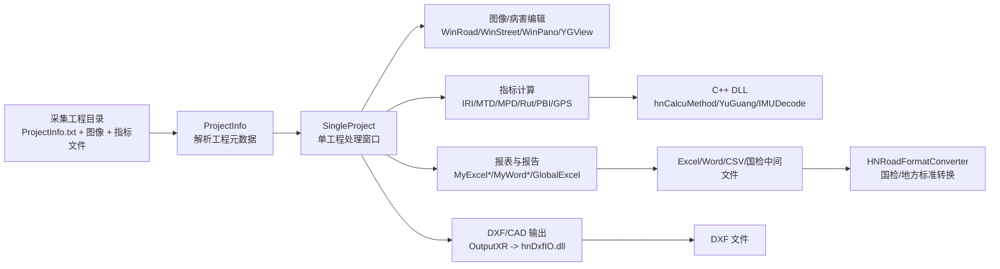

# XRDataProcess

`XRDataProcess` 是一个面向公路、农村路和城镇道路检测数据的 Windows 桌面端内业处理系统。主程序用于导入道路采集工程，查看路面/景观/全景图像，编辑和管理病害，计算 IRI 平整度、构造深度、车辙、跳车、PQI/PCI 等指标，并按不同养护规范或客户模板导出 Excel、Word、DXF、国检转换数据等成果。

项目是一个历史较长的 Visual Studio 解决方案，核心是 C#/.NET Framework WinForms + DevExpress UI，局部性能和专用算法由 C++/C++ CLI DLL 提供。

## 适用场景

- 公路技术状况检测数据的后处理、指标计算和报表输出。
- 农村公路、等级公路、城镇道路等不同标准的数据处理。
- 路面病害框选、编辑、汇总和图像联动查看。
- IRI/MTD/MPD/车辙/跳车/GPS/高精度定位等采集结果的读取、计算和导出。
- 国检平台或地方定制模板的数据格式转换。

## 技术栈

| 类型 | 说明 |
| --- | --- |
| 主语言 | C#、C++、C++/CLI |
| 主框架 | .NET Framework 4.8 |
| UI | Windows Forms、DevExpress Ribbon/Docking/Charts |
| 数据与文档 | Excel/Word Interop、NPOI、Spire.XLS、Spire.PDF、SQLite、SqlSugar |
| 原生集成 | P/Invoke 调用 C++ DLL，OpenGL/Ladybug SDK/图像处理 DLL |
| 构建工具 | Visual Studio 2022，MSBuild，NuGet packages.config |

## 解决方案结构

当前 `XRDataProcess.sln` 加载的主要项目如下：

| 项目 | 类型 | 作用 |
| --- | --- | --- |
| `XRDataProcess/` | C# WinForms 主程序 | 内业数据处理软件主界面，工程导入、图像查看、病害编辑、指标计算、报表/报告/DXF 输出。 |
| `Farmework/` | C# 类库 | 通用基础库，包含日志、INI 配置、Office 辅助、编码识别、通用工具等。目录名保留历史拼写 `Farmework`。 |
| `HNDtos/` | C# 类库 | DTO/实体定义，目前包含 SqlSugar 实体，如合肥道路数据实体。 |
| `DataConvertGJ/HNRoadFormatConverter/` | C# WinForms 工具 | 国检数据转换软件，将内业软件输出的通用中间数据转换为不同国检/地方标准要求的文件、表格和图片结构。 |
| `hnCalcuMethod/` | C++ DLL | IRI 平整度、IMU/DAQ 数据处理、重采样、速度和跳车相关计算。 |
| `hnDxfIO/` | C++ DLL | DXF 输出，包含路面病害、城市道路、省道路等 CAD 导出逻辑。 |
| `HnHighAccConvertPlane/` | C++ App/DLL | 高精度经纬高到投影坐标转换。 |
| `IMUDecode/` | C++/CLI DLL | IMU/导航数据解析。 |
| `YuGuang/` | C++ DLL | 路面图像加载、缓存、缩放、锐化等图像处理接口。 |

仓库内还存在一些辅助或历史项目目录，例如 `Pylon/`、`hnConvertIRI/`、`hnConvertIRM/`、`hnPanoShowAPITest/`、`hnVillageHandleCoord/`、`IMUDecodeTest/` 等。它们不一定都在当前解决方案中加载，修改前应先确认是否仍参与构建或发布。

## 核心运行流程



## 关键代码入口

建议从下面几个文件开始理解项目：

| 文件 | 作用 |
| --- | --- |
| `XRDataProcess/Program.cs` | 主程序入口。正常启动 `MainForm`；传入 `--auto-test` 时执行自动校验流程。 |
| `XRDataProcess/MainForm.cs` | DevExpress Ribbon 主窗体。管理多个工程窗口、全局设置、菜单命令、自动测试入口。 |
| `XRDataProcess/SingleProject.cs` | 单个道路工程的核心处理类。负责读取工程目录、组织子窗口、调用算法、导出报表。 |
| `XRDataProcess/ProjectInfo.cs` | 解析工程目录中的 `ProjectInfo.txt`，维护道路、桩号、采集模块和工程元数据。 |
| `XRDataProcess/XRSetting.cs` | 软件配置模型，读取和写入用户目录中的 `XRSetting.ini`。包含标准类型、报表类型、计算阈值等大量开关。 |
| `XRDataProcess/RoadConfig.cs` | 道路和检测参数配置。 |
| `XRDataProcess/Disease.cs`、`RoadDiseaseType.cs`、`RoadDiseaseTypes.cs` | 病害数据结构、病害类型和病害参数加载。 |
| `XRDataProcess/GlobalExcel.cs`、`MyExcel*.cs` | Excel 报表计算和模板输出。不同文件对应不同标准或客户模板。 |
| `XRDataProcess/MyWord*.cs` | Word 报告输出。 |
| `XRDataProcess/OutputXR.cs` | 通过 `hnDxfIO.dll` 输出 DXF。 |
| `XRDataProcess/HighAccuracyPositioning.cs` | 高精度定位相关 P/Invoke 封装。 |
| `DataConvertGJ/HNRoadFormatConverter/Form1.cs` | 国检转换工具主窗体和主要转换流程。 |

## 业务概念速查

| 概念 | 说明 |
| --- | --- |
| 工程目录 | 一次道路采集任务的数据目录，通常包含 `ProjectInfo.txt`、图像、指标、病害等文件。 |
| 桩号/里程 | 道路工程定位单位，代码中常用 mile、dmi、start/end mile 表示。 |
| IRI/RQI | 平整度相关指标。IRI 原始或分段值通常来自 DAQ/IMU/激光数据，RQI 为评价指标。 |
| MTD/MPD | 构造深度/宏观纹理深度相关指标。 |
| Rut/RDI | 车辙及车辙评价相关指标。 |
| PCI/PQI/PBI/SCI/TCI | 路面、综合、跳车、景观等不同评价和汇总指标。 |
| 病害 | 路面或沿线设施损坏对象，通常关联图像、位置、面积、类型、程度。 |
| 标准类型 | `StandardParmType` 定义了等级公路 2007/2018/2001、城镇道路、北京/辽宁/广西/重庆/湖南/低等级农村路等标准。 |
| 国检转换 | 将内业软件输出的通用数据转换成国检或地方平台要求的目录、图片、表格和编码格式。 |

## 原生 DLL 与外部依赖

主程序通过 P/Invoke 调用多个原生 DLL：

- `hnCalcuMethod.dll`：IRI、IMU/DAQ、重采样、跳车/加速度相关计算。
- `hnDxfIO.dll`：DXF/CAD 输出。
- `HnHighAccConvertPlane.dll` 或同名模块：经纬高到投影坐标转换。
- `IMUDecode.dll`：IMU/导航数据解析。
- `YuGuang.dll`：道路图像加载与处理。
- `ladybug.dll`、`LadybugGUI.dll`：Point Grey/FLIR Ladybug 全景相机 SDK。
- Windows 系统 DLL：`kernel32.dll`、`user32.dll`、`gdi32.dll`、`opengl32.dll`、`shlwapi.dll`。

运行时需要保证这些 DLL 位于程序输出目录或系统可搜索路径中。C++ 项目的部分配置会把输出写到解决方案根目录的 `Output/`，该目录属于构建产物，不应提交到 Git。

## 构建和运行

### 环境要求

1. Windows。
2. Visual Studio 2022。
3. .NET Framework 4.8 Developer Pack。
4. Visual Studio 工作负载：
   - `.NET desktop development`
   - `Desktop development with C++`
5. NuGet 包还原能力。项目使用传统 `packages.config`。
6. DevExpress 22.1 运行/开发组件。
7. 如需完整运行全景和相机功能，需要安装 Ladybug SDK 及对应运行库。
8. 如需 Word/Excel Interop 导出，需要本机安装 Microsoft Office。

### 构建步骤

1. 用 Visual Studio 打开 `XRDataProcess.sln`。
2. 还原 NuGet 包。
3. 选择合适平台。主程序和多数原生 DLL 以 `x64`/`Mixed Platforms` 为主，部分历史配置包含 `Win32`。
4. 先构建原生依赖项目：
   - `hnCalcuMethod`
   - `hnDxfIO`
   - `HnHighAccConvertPlane`
   - `IMUDecode`
   - `YuGuang`
5. 再构建 C# 类库和主程序：
   - `HNDtos`
   - `Farmework`
   - `XRDataProcess`
6. 启动 `XRDataProcess`。

如果缺少 DevExpress、Ladybug、Office 或原生 DLL，主程序可能能编译但运行到对应功能时失败。

## 自动校验

`XRDataProcess/Program.cs` 支持命令行参数：

```powershell
内业数据处理软件V2.2.5.exe --auto-test
```

该模式会创建 `MainForm` 并调用 `AutoTest()`。当前测试数据路径写在 `MainForm.AutoTest()` 中，例如 `D:\统一测试数据\...`。如果本机没有这些统一测试数据，自动校验会失败或无法覆盖完整流程。

## 重要配置和运行时文件

| 位置 | 说明 |
| --- | --- |
| `XRDataProcess/app.config` | .NET Framework 启动配置、DPI 设置、用户设置声明。 |
| `XRDataProcess/CfgFiles/log4net.cfg.xml` | log4net 配置。 |
| `%LocalAppData%\夕睿光电\内业数据处理软件\XRSetting.ini` | 主程序用户级配置。`XRSetting` 首次运行会从安装目录复制默认配置。 |
| `%LocalAppData%\夕睿光电\国检转换软件\Settings` | 国检转换工具的用户设置目录。 |
| `Output/` | 构建和发布输出目录，包含 exe/dll/xml/pdb 等产物，应由构建生成，不纳入源码管理。 |
| `打包/` | 安装包/发布包目录，文件很大，不纳入源码管理。 |

## 给 AI 代码助手的快速阅读指南

如果你是 AI 或新维护者，请按下面顺序建立上下文：

1. 先读 `XRDataProcess.sln`，确认当前参与构建的项目。不要假设仓库里的所有目录都在解决方案中。
2. 读 `XRDataProcess/Program.cs`，确认启动路径和 `--auto-test` 分支。
3. 读 `XRDataProcess/MainForm.cs` 的构造函数、菜单事件和 `AutoTest()`，理解主界面如何组织工程。
4. 读 `XRDataProcess/SingleProject.cs` 的构造函数、工程加载、指标计算和报表输出相关方法。这个文件是业务主干。
5. 读 `XRDataProcess/ProjectInfo.cs`，理解工程目录和 `ProjectInfo.txt` 的字段映射。
6. 读 `XRDataProcess/XRSetting.cs` 和 `RoadConfig.cs`，理解不同标准、模板、阈值、异常处理开关。
7. 报表问题优先查 `MyExcel*.cs`、`GlobalExcel.cs`、`MyWord*.cs`；DXF 问题查 `OutputXR.cs` 和 `hnDxfIO/`。
8. IRI/平整度问题查 `SingleProject.cs` 的 P/Invoke 调用，再进入 `hnCalcuMethod/hnCalcuIRIMethodApi.cpp`。
9. 图像加载/显示问题查 `WinRoadImg.cs`、`WinRoadNew.cs`、`YGView.cs` 和 `YuGuang/`。
10. 国检转换问题查 `DataConvertGJ/HNRoadFormatConverter/Program.cs` 和 `Form1.cs`。

维护时请注意：

- 不要随意改 `.Designer.cs` 和 `.resx`，除非是通过 WinForms 设计器或明确知道控件生成逻辑。
- 不要提交 `Output/`、`打包/`、`.vs/`、`bin/`、`obj/`、`ipch/`、`x64/`、`Release/` 等生成产物。
- 很多业务规则通过配置和枚举控制，先查 `XRSetting`、`RoadConfig`、`StandardParmType`，再改计算或导出逻辑。
- 大量代码依赖中文路径、中文模板名和历史客户标准，改名会影响运行时文件定位。
- 这个项目混合 C# 和 C++，修复 P/Invoke 相关问题时必须同时检查函数名、调用约定、平台位数和输出 DLL 路径。
- 某些代码文件包含历史备份或旧实现，如 `*.bak*.cs`，修改前先确认当前 `.csproj` 是否编译该文件。

## Git 管理建议

本仓库应只保存源码、工程文件、配置模板和小型文档。以下内容不建议提交：

- 编译输出：`Output/`、`bin/`、`obj/`、`x64/`、`Release/`
- Visual Studio 缓存：`.vs/`、`ipch/`、`*.VC.db`、`*.sdf`
- 安装包和发布包：`打包/`、`*.cab`、`*.msi`、大型 `*.exe`
- 本地用户设置：`*.user`、`*.suo`
- 大型测试数据、采集工程数据、客户原始数据

如果未来必须管理大型二进制文件，应使用 Git LFS，并在 README 中明确下载和恢复方式。

## 当前状态说明

- 根目录 `README.md` 是项目总览文档。
- 解决方案主入口为 `XRDataProcess.sln`。
- 主程序程序集名为 `内业数据处理软件V2.2.5`。
- 当前项目依赖较多商业/本地运行库，克隆仓库后不一定能在干净机器上直接完整运行，需要按上面的环境要求补齐依赖。
